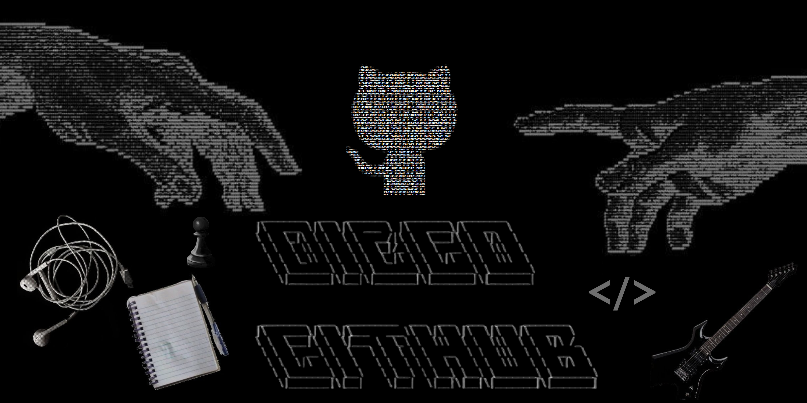
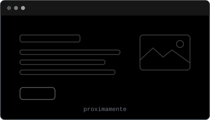

  
  
  

  

 

<h2 align="center"> <em>About me</em></h2>

  ¡Hola! Soy <em><b>Diego</b></em>, estudiante de Ingeniería en Informática
  en la PUCV 🇨🇱. Me enfoco en desarrollar apps y sitios web de punta a
  punta: frontend con foco en UX, backend con bases de datos, y conectar
  todo mediante APIs. Antes de escribir código me gusta diagramar y
  planear la solución. También me interesa harto la ciberseguridad y
  la Inteligencia Artificial.

 

    <em><b>Estudiante de Ingeniería en Informática - PUCV</b></em>  
    <em><b>Desarrollo de apps y webs (frontend, backend y APIs)</b></em>  
    <em><b>Construyendo proyectos web reales (Dulce Frutilla, ASCII Art Studio)</b></em>  
    <em><b>Interesado en ciberseguridad e Inteligencia Artificial</b></em>  

 

<h2 align="center"> <em>Technologies</em></h2>

  
  
  
  
  
  
  
  
  
  
  
  
  
  
  
  

 

<h2 align="center"> <em>Live projects</em></h2>

<!--
  ¿Cómo agregar un proyecto nuevo?
  1. Copia uno de los bloques <td> ... </td> de abajo y pégalo dentro de un <tr>.
  2. Cambia el nombre, la descripción y el enlace del sitio (los href="#").
  3. Para la captura: guarda una imagen en imgs/ (ej. imgs/proyecto1.png)
     y reemplaza imgs/preview-soon.svg por esa ruta.
  Cada <tr> lleva 2 proyectos. Al tener 3, abre otro <tr> debajo.

  ¿Quieres mostrar también el repositorio en algún proyecto?
  Agrega este bloque justo debajo del botón "Ver sitio" de esa tarjeta:

      
-->

<table align="center" width="100%">
  <tr>
    <td width="50%" align="center">
      
       
      <b>Dulce Frutilla</b>
       
      Sitio para un emprendimiento de tortas artesanales en Santiago.
        
      
      
      
        
      
    </td>
    <td width="50%" align="center">
      
       
      <b>ASCII Art Studio</b>
       
      Editor web para crear imágenes y texto hechos de caracteres.
        
      
      
      
        
      
    </td>
  </tr>
  <tr>
    <td width="50%" align="center">
      
       
      <b>Próximamente</b>
       
      Nuevo proyecto en construcción.
        
      
    </td>
    <td width="50%" align="center">
      
       
      <b>Próximamente</b>
       
      Nuevo proyecto en construcción.
        
      
    </td>
  </tr>
</table>

 

<h2 align="center"> <em>Statistics</em></h2>

  

  

