  
  
  

  

 

<h2 align="center"> <em>About me</em></h2>

  ¡Hola! Soy <em><b>Diego</b></em>, estudiante de Ingeniería en Informática
  en la PUCV 🇨🇱. Me gusta entender cómo funcionan las cosas por dentro:
  desde la consulta SQL hasta el modelo que toma la decisión. Hoy estoy
  metido en el mundo del desarrollo de software y los datos, construyendo
  proyectos pequeños para aprender haciendo.

 

    <em><b>Estudiante de Ingeniería en Informática en la PUCV</b></em>  
    <em><b>Aprendiendo Machine Learning y ciencia de datos</b></em>  
    <em><b>Compitiendo en Kaggle</b></em>  
    <em><b>Interesado en datos y finanzas</b></em>  

 

<h2 align="center"> <em>Technologies</em></h2>

  
  
  
  
  
  
  
  
  
  
  

 

<h2 align="center"> <em>Statistics</em></h2>

  

